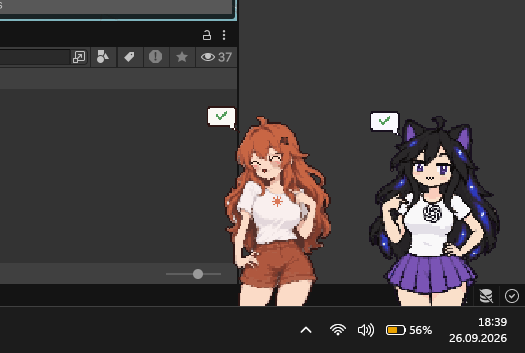

# aipets

**Animated desktop companions for your AI tools on Windows.**

Keep your favorite AI tools just above your taskbar as little characters. Click a pet to open its website, desktop app or terminal. Supported agents also show when they are **working**, **need your input** or **have finished**.


All seven pets use animated pixel art.

[Get started](#get-started) · [Supported pets](#supported-pets) · [Setup guide](docs/setup.md) · [Status hooks](docs/hooks.md)

## What it can do

- **Show agent activity:** a spinner while working, **?** when input is needed, and **✓** when finished, depending on the integration.
- **Open your tools:** every pet has the same Website, Desktop app and Program choices, with your own link, executable, command and working folder.
- **Make the desktop yours:** drag, hide and resize pets from 162 pixels up to screen height. Positions and sizes are remembered; dragging a pet brings it to the front.
- **Stay out of the way:** hide all pets at once for screen sharing. They also hide automatically for fullscreen apps.
- **React and animate:** blinking, hover and click reactions, and sleeping while you are away. Manage everything from the tray icon or a pet's right-click menu.

## See the status at a glance

Real desktop screenshots with Claude and Astra:

| Working | Waiting for you | Done |
| :---: | :---: | :---: |
|  |  |  |

### A few ways to use it

- **Keep an eye on background coding.** Let an agent work while you use another app, then notice when it finishes or asks a question.
- **Use several AI tools together.** Give Claude, Codex and Cursor their own visible companion. Each pet combines the sessions for its agent; a waiting session takes priority.
- **Keep a favorite tool one click away.** Use a pet as a shortcut to ChatGPT, Gemini, Grok or Copilot, or simply enjoy the animated company.

## Get started

**You need:** Windows 10/11 with .NET Framework 4.8. Windows Terminal is optional. Install the AI tools you want to launch separately; aipets does not include them.

1. [Download the latest source ZIP](https://github.com/exoteric33/aipets/archive/refs/heads/main.zip) and extract it into a folder you intend to keep. You can also clone this repository.
2. Double-click **`install.cmd`**. It builds the app, enables **Start with Windows**, adds status hooks for detected agents and starts the pets. No Python or separate .NET SDK is needed.
3. Click the **aipets tray icon** (check the hidden icons behind **^**) to choose which pets to show, their size and what a click opens.
4. Restart any running agents so they load the new hooks. If setup reports that Codex hooks need approval, follow its `/hooks` instructions.

Use the source ZIP for the features shown here; the existing `v0.1.0-rc.1` binary release is older.

**Defaults:** every pet opens its website. Program mode starts without extra arguments and uses the CLI's own saved configuration. The **CLI arguments** dropdown offers **Standard (no arguments)**, optional **Bypass permissions** for supported CLIs, and **Custom arguments**. See the [setup guide](docs/setup.md#terminal-arguments).

## Supported pets

| Pet | Default click opens | Live status |
| --- | --- | --- |
| **Claude** | Claude website | Working, waiting, done |
| **Hermes** | Hermes Agent website | Working, approval waiting, done |
| **Astra (Codex)** | ChatGPT website | Working, waiting, done; also supports Codex desktop sessions |
| **Gemini** | Gemini website | No integration |
| **Grok** | Grok website | No integration |
| **Cursor** | Cursor website | Working and done |
| **Copilot** | Microsoft Copilot website | No integration |

Switch **Click opens** in settings or the pet's right-click menu: **Website → Desktop app → Program**. Every pet supports a custom desktop executable as well as a website or program. Desktop app presets are available for Claude, Hermes, Astra, Cursor and Copilot. Astra's website is **chatgpt.com**. Copilot is **Microsoft Copilot**.

Status depends on the agent's hooks, independently of the chosen click action. Opening a website does not let aipets read that chat's status. Clicking a waiting pet opens the configured tool; it does not select the specific waiting conversation.

## How it works

aipets runs locally as a Windows tray app, with one process per visible pet. Agent hooks write small status files that update the bubbles. Astra also reads local Codex transcripts to detect questions. Settings, logs and status files live in `%APPDATA%\aipets`; your AI tools handle the conversations.

## Everyday controls

| Action | How |
| --- | --- |
| Open an AI tool | Left-click its pet |
| Move a pet / bring it to the front | Drag it |
| Change its click action or size | Right-click the pet, or open settings |
| Set all pets to the same height | Move **Size of all pets**; this replaces individual sizes |
| Hide everything temporarily | Turn on **Hide all pets** in settings or the tray menu; turning it off restores your selection |
| Change startup behavior | Toggle **Start with Windows** |
| Quit | Right-click the tray icon → **Quit** |

**Update, move or remove:** see the [setup guide](docs/setup.md#update). Double-click `uninstall.cmd` to stop aipets and remove its startup entry and hooks; your saved settings remain.

## Limits and troubleshooting

- Gemini, Grok and Copilot have no built-in status integration. Cursor has no **?** indicator; its hooks still need verification in a real Cursor session.
- Status in the Claude desktop app and Hermes Desktop, and behavior across multiple monitors, still need manual verification.
- Codex question tracking depends on its transcript format. An interrupted turn without a closing hook can leave the spinner visible for up to 15 minutes.
- The Windows executable is unsigned.

Missing a status bubble? Check **Settings → Status display → Set up hooks**, then restart the agent. More detail: [setup and troubleshooting](docs/setup.md) · [manual hook configuration](docs/hooks.md).

## Build from source

```powershell
.\build.ps1
```

Builds with the C# compiler included with Windows and restarts a running aipets installation after a successful build. Keep `aipets.exe` beside the `pets\` folder. See [build options](docs/setup.md#build-options) for an isolated build.

## License

Source code: [MIT](LICENSE). Pet graphics, including the previews in this README, and third-party names and logos are not covered by that license. aipets is an unofficial fan project, unaffiliated with the AI providers.
