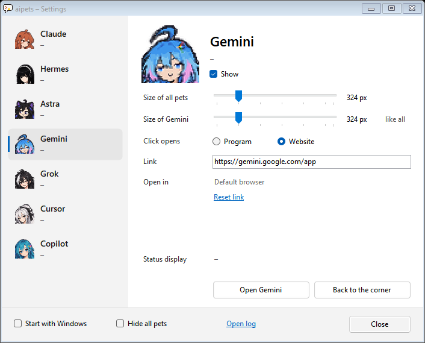

# Setup and configuration

[← Back to the README](../README.md)

## Install

Use Windows 10/11 with .NET Framework 4.8. Windows Terminal is optional; aipets falls back to the Windows console. The AI programs and desktop apps must be installed separately.

1. Download the [current source ZIP](https://github.com/exoteric33/agent-desktop-pets/archive/refs/heads/main.zip), or clone the repository:

   ```powershell
   git clone https://github.com/exoteric33/agent-desktop-pets.git
   cd agent-desktop-pets
   ```

2. Put the extracted or cloned folder where you want to keep it. Startup and hooks store the path to `aipets.exe`.
3. Double-click `install.cmd`. In a source checkout, it compiles the executable with Windows' .NET Framework C# compiler. A binary package containing no source skips compilation.
4. Review the setup summary, then restart running agents to load the hooks.

The installer turns on **Start with Windows**, adds hooks for detected Claude Code, Codex, Hermes Agent and Cursor installations, sets up hook approvals where possible, and starts aipets. Automatic Codex approval requires the Codex CLI; otherwise the summary explains how to trust the aipets hooks through `/hooks`.

Existing matching hooks are kept. Files edited directly by aipets are backed up as `<file>.bak-aipets`; Codex trust settings are managed separately through Codex. Running the installer again is supported, but it explicitly turns **Start with Windows** back on.

The current `main` branch contains features added after the `v0.1.0-rc.1` binary release. Use the current source for the behavior and images in the README.

## Choose what a click opens

Open settings with a left-click on the aipets tray icon. Select a pet, then choose **Click opens**. The same choices appear in the pet's right-click menu.

| Mode | Configuration |
| --- | --- |
| **Program** | Program, arguments, terminal and working folder. Windows Terminal is used when available. |
| **Desktop app** | Available for Claude, Hermes, Astra, Cursor and Copilot. aipets detects supported installations; use **…** to choose a different executable. |
| **Website** | An HTTP or HTTPS address in your default browser. A bare domain such as `grok.com` becomes `https://grok.com/`. |

- **Astra:** app mode uses `codex app` in the chosen working folder, without opening a terminal. If the CLI is unavailable, it tries the installed app package directly. Website mode opens `https://chatgpt.com/` by default.
- **Hermes:** if Hermes Desktop has not been built, app mode starts `hermes desktop` in a terminal. The first build can take several minutes; later clicks start the built app directly.
- **Cursor:** the program preset is the `cursor` editor command.
- **Copilot:** the app preset is Microsoft Copilot. Program mode is available for your own command; it has no preset command.
- **Gemini and Grok:** their default is the website. Program mode has `gemini` and `grok` presets; install and configure the intended CLI yourself. The Grok preset has not been verified against a real CLI installation.

Changing the launch mode does not add a status integration. Status always comes from the sources listed in the [README](../README.md#supported-pets).

### Terminal arguments

The shipped program presets use these arguments:

| Pet | Default command |
| --- | --- |
| Claude | `claude --dangerously-skip-permissions` |
| Hermes | `hermes --yolo` |
| Astra | `codex --dangerously-bypass-approvals-and-sandbox` |

These flags bypass the agents' usual permission prompts; the Codex flag also disables its sandbox. To use the tools' normal defaults, choose **Program** mode in settings and remove the flag from **Arguments** before launching.

## Appearance, size and visibility

- **Move:** drag a pet anywhere. It snaps near the taskbar and faces toward the screen center. Dragging brings it in front of the other pets, and that order survives restarts.
- **Size of all pets:** sets every pet to the same height and replaces individual height overrides.
- **Size of a single pet:** changes just that pet until the shared slider is moved again. **like all** restores the shared height.
- **Size range:** 162 pixels up to the available screen height. A pet is reduced to fit if its screen is too small.
- **Appearance:** Cursor and Copilot offer **Pixel** and **Original**. Both are animated. Switching preserves position, size and visibility.
- **Show:** enable or hide individual pets. Hidden pets stay hidden across restarts.
- **Hide all pets:** hides the entire group without losing the individual selection. While it is active, individual **Show** controls are disabled. This setting also survives restarts.
- **Fullscreen apps:** pets hide automatically while another application is fullscreen.
- **Start with Windows:** enabled on installation; turn it off in settings or the tray menu if you prefer manual startup.



Menus and dialogs belonging to aipets stay above the pets. Before any pet is dragged, their stacking follows the order in the pet list. Advanced users can reset the saved order by removing `layers=` under `[app]` in `%APPDATA%\aipets\settings.ini` while aipets is closed.

## Update

In a Git clone, run:

```powershell
git pull --ff-only
.\build.ps1
```

The build compiles first, then replaces the executable and restarts the running installation. A failed compilation leaves the existing executable and pets running. Personal settings are stored separately from the repository.

For a ZIP installation, quit aipets, replace the application files with the newly extracted source and run `install.cmd`. Keep the `pets\` folder with the executable. If you use a new location, follow the move instructions below. Running the installer re-enables startup with Windows.

### Moved the folder or added an agent?

- **Moved aipets:** run `install.cmd` from the new location to update startup, hook commands and approvals.
- **Installed another supported agent:** choose it in settings, then click **Set up hooks** under **Status display**. Restart the agent afterward.
- **Hooks point to another copy:** the status section reports **Hooks call a different aipets.exe**. Use **Set up hooks** to repair them.

## Uninstall

Double-click `uninstall.cmd`. It stops aipets, disables its startup entry and removes its hooks. You can then delete the application folder.

Settings and logs remain in `%APPDATA%\aipets`; delete that folder too if you want to remove saved preferences. Existing Codex hook trust records may remain in Codex's configuration and are harmless without the corresponding hooks.

## Troubleshooting

| Problem | What to check |
| --- | --- |
| No pets are visible | Find the tray icon behind **^**. Turn off **Hide all pets**, enable **Show** for a pet, and leave fullscreen mode. |
| Clicking a pet cannot open its tool | Check **Click opens**, the detected app or program path, and whether the chosen tool is installed. |
| No working or waiting indicator | Confirm that the pet supports it, check **Status display → Set up hooks**, then restart the agent. Websites do not report chat status. |
| Codex hooks do not run | Follow the setup summary's `/hooks` approval instructions. Changing a hook command or moving the executable can require trust again. |
| Codex remains busy after an interruption | If no closing hook arrives, the spinner may remain until the 15-minute timeout. The **?** indicator also depends on Codex's local transcript format. |
| Cursor never shows **?** | Cursor's integration only handles working and completion. Real-session verification is still outstanding. |
| Hermes hook setup reports a YAML error | Compact non-empty inline hook lists and duplicate hook keys are unsupported. Setup leaves the file intact; use ordinary indented lists as in the [hook examples](hooks.md#hermes-agent). |

For diagnostics, look in `%APPDATA%\aipets\aipets.log`. Settings are in `settings.ini`; hook status files are under `status\`. Cursor also reports hook calls in its **Hooks** output channel.

The Claude desktop app and Hermes Desktop status hooks, and multi-monitor behavior, still need manual verification. The executable is unsigned.

## Build options

The public repository includes the sprites and app icon, so building needs neither Python nor a separate .NET SDK.

```powershell
.\build.ps1
.\build.ps1 -OutputDirectory C:\Temp\aipets-build
```

The first command rebuilds the app and restarts it if it was running from that folder. The second builds in isolation and leaves the running installation untouched. An isolated build outputs only the executable; copy `pets\` beside it before running it. The version number is defined in `src/AssemblyInfo.cs`.

`aipets.exe --install` and `aipets.exe --uninstall` perform the setup actions used by the two `.cmd` files; add `--quiet` to suppress the summary window. Manual configuration examples are in [Status hooks](hooks.md).
